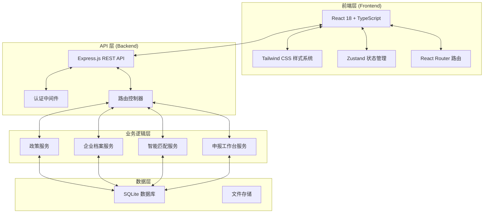
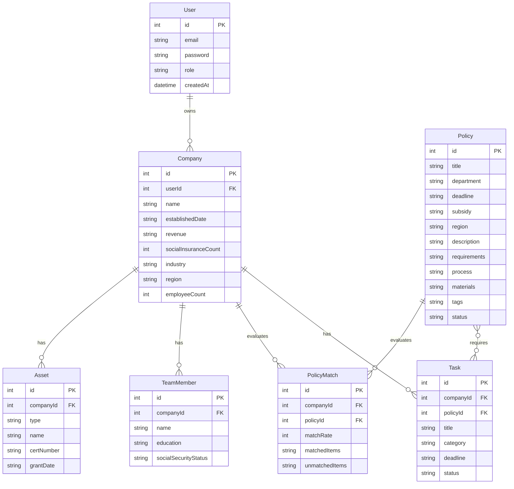

## 1. 架构设计



## 2. 技术选型说明

- **前端**：React@18 + TypeScript + Vite + Tailwind CSS
- **初始化工具**：vite-init（react-express-ts 模板）
- **后端**：Express.js@4 + TypeScript（ESM 格式）
- **数据库**：SQLite（通过 better-sqlite3），MVP 阶段无需单独数据库服务器
- **状态管理**：Zustand
- **路由**：React Router v6
- **图标库**：lucide-react
- **认证**：JWT（jsonwebtoken + bcryptjs）
- **数据校验**：zod

## 3. 路由定义

### 3.1 前端路由

| 路由 | 页面 | 说明 |
|------|------|------|
| / | 首页仪表盘 | 企业健康度评分、推荐项目、申报日历 |
| /login | 登录页 | 用户登录 |
| /register | 注册页 | 用户注册 |
| /policies | 政策库 | 政策列表与筛选 |
| /policies/:id | 政策详情 | 政策详情展示 |
| /company/profile | 企业档案 | 企业基础信息管理 |
| /company/assets | 资质资产 | 软著/专利证书管理 |
| /company/team | 人员结构 | 研发团队管理 |
| /matching | 智能匹配 | 政策匹配结果展示 |
| /workbench | 申报工作台 | 申报任务清单与材料管理 |
| /admin/dashboard | 园区驾驶舱 | 园区管理员总览 |

### 3.2 后端 API 路由

| 方法 | 路由 | 说明 |
|------|------|------|
| POST | /api/auth/register | 用户注册 |
| POST | /api/auth/login | 用户登录 |
| GET | /api/auth/me | 获取当前用户信息 |
| GET | /api/policies | 获取政策列表（支持筛选） |
| GET | /api/policies/:id | 获取政策详情 |
| GET | /api/company/profile | 获取企业信息 |
| PUT | /api/company/profile | 更新企业信息 |
| GET | /api/company/assets | 获取资质资产列表 |
| POST | /api/company/assets | 添加资质资产 |
| DELETE | /api/company/assets/:id | 删除资质资产 |
| GET | /api/company/team | 获取团队列表 |
| POST | /api/company/team | 添加团队成员 |
| DELETE | /api/company/team/:id | 删除团队成员 |
| GET | /api/matching | 获取所有政策匹配结果 |
| GET | /api/workbench/tasks | 获取申报任务清单 |
| POST | /api/workbench/tasks/:id/status | 更新任务状态 |
| GET | /api/admin/enterprises | 园区管理员获取企业列表 |
| GET | /api/admin/dashboard | 园区驾驶舱数据 |

## 4. API 定义

### 4.1 认证 API

```typescript
// POST /api/auth/register
interface RegisterRequest {
  email: string;
  password: string;
  companyName: string;
}

interface RegisterResponse {
  token: string;
  user: User;
}

// POST /api/auth/login
interface LoginRequest {
  email: string;
  password: string;
}

interface LoginResponse {
  token: string;
  user: User;
}
```

### 4.2 政策 API

```typescript
// GET /api/policies?department=&region=&supportType=&page=&limit=
interface PolicyQuery {
  department?: string;
  region?: string;
  supportType?: string;
  page?: number;
  limit?: number;
}

interface PolicyListItem {
  id: number;
  title: string;
  department: string;
  deadline: string;
  subsidy: string;
  region: string;
  matchRate: number;
  tags: string[];
}

// GET /api/policies/:id
interface PolicyDetail extends PolicyListItem {
  requirements: {
    revenue: string;
    employees: string;
    ipRequirement: string;
    otherRequirements: string[];
  };
  process: string[];
  materials: string[];
  description: string;
}
```

### 4.3 企业档案 API

```typescript
// GET /api/company/profile
interface CompanyProfile {
  id: number;
  name: string;
  establishedDate: string;
  revenue: string;
  socialInsuranceCount: number;
  industry: string;
  region: string;
  employeeCount: number;
}

// PUT /api/company/profile
interface UpdateCompanyRequest {
  revenue?: string;
  socialInsuranceCount?: number;
  industry?: string;
  region?: string;
  employeeCount?: number;
}

// POST /api/company/assets
interface AssetInput {
  type: 'SOFTWARE_COPYRIGHT' | 'PATENT' | 'HIGH_TECH_CERT' | 'ISO' | 'CMMI';
  name: string;
  certNumber: string;
  grantDate: string;
}
```

### 4.4 智能匹配 API

```typescript
// GET /api/matching
interface MatchingResult {
  policyId: number;
  policyTitle: string;
  matchRate: number;
  matchedItems: string[];
  unmatchedItems: string[];
  subsidy: string;
  deadline: string;
}
```

## 5. 服务器架构图

```mermaid
graph TD
    "客户端 Browser" --> "Express Router"
    "Express Router" --> "AuthController"
    "Express Router" --> "PolicyController"
    "Express Router" --> "CompanyController"
    "Express Router" --> "MatchingController"
    "Express Router" --> "WorkbenchController"
    "Express Router" --> "AdminController"
    
    "AuthController" --> "AuthService"
    "PolicyController" --> "PolicyService"
    "CompanyController" --> "CompanyService"
    "MatchingController" --> "MatchingService"
    "WorkbenchController" --> "WorkbenchService"
    "AdminController" --> "AdminService"
    
    "AuthService" --> "UserRepository"
    "PolicyService" --> "PolicyRepository"
    "CompanyService" --> "CompanyRepository"
    "MatchingService" --> "PolicyRepository"
    "WorkbenchService" --> "TaskRepository"
    "AdminService" --> "CompanyRepository"
    
    "UserRepository" --> "SQLite Database"
    "PolicyRepository" --> "SQLite Database"
    "CompanyRepository" --> "SQLite Database"
    "TaskRepository" --> "SQLite Database"
```

## 6. 数据模型

### 6.1 实体关系图



### 6.2 数据定义语言

```sql
-- 用户表
CREATE TABLE users (
    id INTEGER PRIMARY KEY AUTOINCREMENT,
    email TEXT NOT NULL UNIQUE,
    password TEXT NOT NULL,
    company_name TEXT DEFAULT '',
    role TEXT DEFAULT 'user' CHECK(role IN ('user', 'admin')),
    created_at DATETIME DEFAULT CURRENT_TIMESTAMP
);

-- 企业表
CREATE TABLE companies (
    id INTEGER PRIMARY KEY AUTOINCREMENT,
    user_id INTEGER NOT NULL UNIQUE,
    name TEXT DEFAULT '',
    established_date TEXT DEFAULT '',
    revenue TEXT DEFAULT '',
    social_insurance_count INTEGER DEFAULT 0,
    industry TEXT DEFAULT '',
    region TEXT DEFAULT '',
    employee_count INTEGER DEFAULT 0,
    FOREIGN KEY (user_id) REFERENCES users(id) ON DELETE CASCADE
);

-- 资质资产表
CREATE TABLE assets (
    id INTEGER PRIMARY KEY AUTOINCREMENT,
    company_id INTEGER NOT NULL,
    type TEXT NOT NULL CHECK(type IN ('SOFTWARE_COPYRIGHT', 'PATENT', 'HIGH_TECH_CERT', 'ISO', 'CMMI')),
    name TEXT NOT NULL,
    cert_number TEXT DEFAULT '',
    grant_date TEXT DEFAULT '',
    FOREIGN KEY (company_id) REFERENCES companies(id) ON DELETE CASCADE
);

-- 团队成员表
CREATE TABLE team_members (
    id INTEGER PRIMARY KEY AUTOINCREMENT,
    company_id INTEGER NOT NULL,
    name TEXT NOT NULL,
    education TEXT DEFAULT '',
    social_security_status TEXT DEFAULT 'active',
    FOREIGN KEY (company_id) REFERENCES companies(id) ON DELETE CASCADE
);

-- 政策表
CREATE TABLE policies (
    id INTEGER PRIMARY KEY AUTOINCREMENT,
    title TEXT NOT NULL,
    department TEXT DEFAULT '',
    deadline TEXT DEFAULT '',
    subsidy TEXT DEFAULT '',
    region TEXT DEFAULT '',
    description TEXT DEFAULT '',
    requirements_json TEXT DEFAULT '{}',
    process TEXT DEFAULT '',
    materials TEXT DEFAULT '',
    tags TEXT DEFAULT '',
    status TEXT DEFAULT 'active' CHECK(status IN ('active', 'expired')),
    created_at DATETIME DEFAULT CURRENT_TIMESTAMP
);

-- 政策匹配结果表
CREATE TABLE policy_matches (
    id INTEGER PRIMARY KEY AUTOINCREMENT,
    company_id INTEGER NOT NULL,
    policy_id INTEGER NOT NULL,
    match_rate INTEGER DEFAULT 0,
    matched_items TEXT DEFAULT '[]',
    unmatched_items TEXT DEFAULT '[]',
    FOREIGN KEY (company_id) REFERENCES companies(id) ON DELETE CASCADE,
    FOREIGN KEY (policy_id) REFERENCES policies(id) ON DELETE CASCADE
);

-- 任务表
CREATE TABLE tasks (
    id INTEGER PRIMARY KEY AUTOINCREMENT,
    company_id INTEGER NOT NULL,
    policy_id INTEGER NOT NULL,
    title TEXT NOT NULL,
    category TEXT DEFAULT 'material',
    deadline TEXT DEFAULT '',
    status TEXT DEFAULT 'pending' CHECK(status IN ('pending', 'in_progress', 'completed')),
    FOREIGN KEY (company_id) REFERENCES companies(id) ON DELETE CASCADE,
    FOREIGN KEY (policy_id) REFERENCES policies(id) ON DELETE CASCADE
);

-- 初始政策数据种子
INSERT INTO policies (title, department, deadline, subsidy, region, description, requirements_json, process, materials, tags) VALUES
('科技型中小企业入库', '科技部', '2026-10-31', '资质认定', '全国', '科技型中小企业评价入库，享受研发费用加计扣除等政策', '{"revenue": "<2亿", "employees": "<500", "ipRequirement": "有自主知识产权"}', '注册→填报→评价→入库', '企业注册信息表,知识产权证书,上年度财务报表', '科技型,基础资质'),
('高新技术企业认定', '科技部', '2026-09-30', '40万元', '苏州', '高新技术企业认定，享受企业所得税优惠（15%税率）', '{"revenue": ">500万", "employees": ">10", "ipRequirement": "Ⅰ类知识产权≥1件或Ⅱ类≥6件"}', '自评→注册→材料编制→提交→评审→公示', '知识产权证明,科技人员证明,研发费用审计报告,高新收入审计报告,产学研协议', '高企,资金补贴,核心资质'),
('太仓市大创园创业资助', '太仓市人社局', '2026-12-31', '5万元', '太仓', '太仓市大学生创业园创业项目资助，支持优秀创业项目', '{"revenue": "<500万", "employees": "≥3", "ipRequirement": "有核心技术或知识产权优先"}', '申请→初审→路演→公示→拨付', '创业计划书,团队介绍,知识产权证明,财务报表', '太仓,创业资助,园区专项');